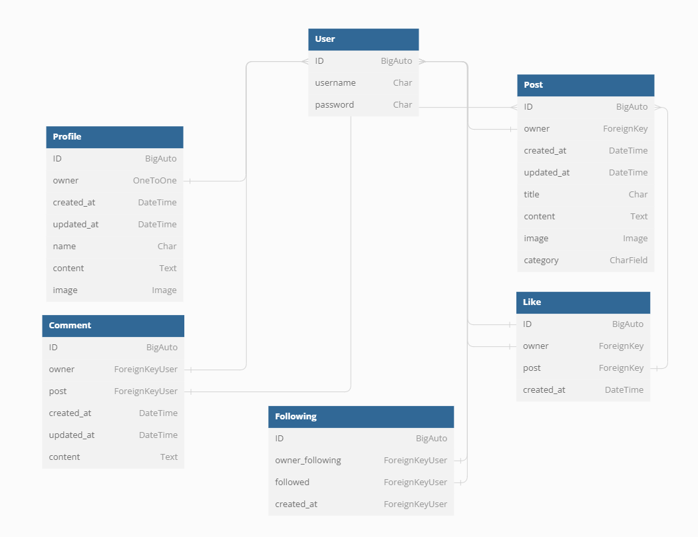

<h1>DevLocker API with Django Rest Framework</h1>

<i>Developer: Jordan Brookfield</i>

[Live link](https://devlocker-api.herokuapp.com/)

This repository was created to store the API set up using Django REST Framework for [DevLocker](https://devlocker.herokuapp.com/)

## Table of Contents

- [User Stories](#user-stories)
- [Database](#database)
- [Technologies Used](#technologies-used)
- [Validation](#validation)
- [Testing](#testing)
- [Credits](#credits)

## User Stories

As this is the back-end of the project, it's sole focus is on the administrative side of the website. Therefore, there is only one user story that needs to be addressed:

- As an admin, I want to be able to create, edit and delete the users, posts, comments and likes, so that I can have a control over the content of the application and remove any potential inappropriate content

## Database

The models shown were created to represent the database model structure of the application:

 

User

- One-to-one relation with the Profile model owner field
- ForeignKeyUser relation with the Following model owner_following and followed fields
- ForeignKey relation with the Post model owner field
- ForeignKeyUser relation with the Comment model owner field
- ForeignKey relation with the Like model owner field

Profile

- The Profile model contains the following fields: ID, owner, created_at, updated_at, name, content and image
- One-to-one relation between the owner field and the User model id field

Post

- The Post model contains the following fields: ID, owner, created_at, updated_at, title, content, image and category
- ForeignKey relation with the Comment model post field
- ForeignKey relation with the Like model post field

Following

- The Following model contains the following fields: ID, owner_following, followed and created_at
- ForeignKeyUser relation between the owner_following and the User model id field
- ForeignKeyUser relation between the followed field and the User model post field

Comment

- The Comment model contains the following fields: ID, owner, post, created_at, updated_at and content
- ForeignKeyUser relation between the owner field and the User model id field
- ForeignKeyUser relation between the post field and the User model post field

Like

- The Like model contains the following fields: ID, owner, post and created_at
- ForeignKey relation between the ID field and the User model id field
- ForeignKey relation between the owner field and the User model id field
- ForeignKey relation between the post field and the Post model post field

## Technologies Used

### Languages & Frameworks

- Python
- Django

### Libraries & Tools

- [Dbdiagram.io](https://dbdiagram.io/home) was used for the database diagram
- [Git](https://git-scm.com/) was used to handle version control with Gitpods terminal enabling me to push my code to the GitHub repo
- [GitHub](https://github.com/) was used to store the projects code
- [Gitpod](https://gitpod.io/workspaces) was the virtual IDE I used to develop the website
- [Django REST Framework](https://www.django-rest-framework.org/) was used to build the back-end API
- [Django AllAuth](https://django-allauth.readthedocs.io/en/latest/index.html) was used for user authentication
- [Psycopg2](https://www.psycopg.org/docs/) was used as a PostgreSQL database adapter for Python
- [PostgreSQL](https://www.postgresql.org/) – deployed project on Render uses a PostgreSQL database
- [Cloudinary](https://cloudinary.com/) to store static files
- [Pillow](https://pillow.readthedocs.io/en/stable/) was used for image processing and validation

## Validation

### PEP8 Validation
[PEP8](http://pep8online.com/) Validation Service was used to check the code for PEP8 requirements. All the code passes with no errors or warnings.
